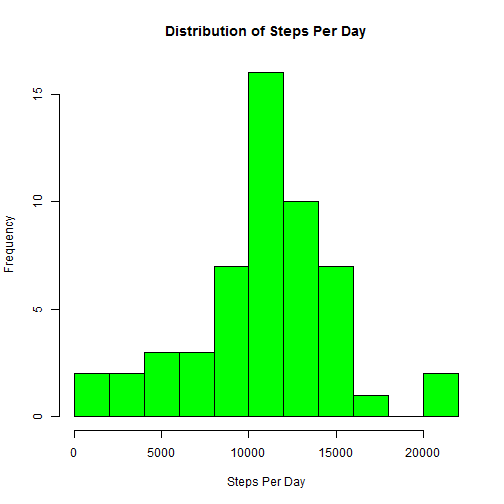

# PA1_template

## Pre-Work

### Notes
* Data Source: https://d396qusza40orc.cloudfront.net/repdata%2Fdata%2Factivity.zip

* Please Note: It is assumed you have set your working directory and unzipped the file from above location into it.

###Goal 
To answer the following questions from the above data source.

1. Code for reading in the dataset and/or processing the data

2. Histogram of the total number of steps taken each day

3. Mean and median number of steps taken each day

4. Time series plot of the average number of steps taken

5. The 5-minute interval that, on average, contains the maximum number of steps

6. Code to describe and show a strategy for imputing missing data

7. Histogram of the total number of steps taken each day after missing values are imputed

8. Panel plot comparing the average number of steps taken per 5-minute interval across weekdays and weekends

9. All of the R code needed to reproduce the results (numbers, plots, etc.) in the report

### Install the necessary libraries.


```r
library("knitr")
library("lubridate")
```

## Assignment

### A - Loading and preprocessing the data

Show any code that is needed to:

1. Load the data (i.e. read.csv())

```r
baseData <- read.csv("activity.csv")
```

2. Process/transform the data (if necessary) into a format suitable for your analysis

```r
baseData$date <- ymd(baseData$date)
```

### B - What is mean total number of steps taken per day?

For this part of the assignment, you can ignore the missing values in the dataset.

1. Calculate the total number of steps taken per day

```r
dailySteps <- aggregate(steps~date, baseData, FUN=sum, na.rm=TRUE)
```

2. Make a histogram of the total number of steps taken each day

```r
hist(dailySteps$steps, 10, main = "Distribution of Steps Per Day", xlab = "Steps Per Day", col = "Green")
```

 

3. Calculate and report the mean and median of the total number of steps taken per day

```r
mean(dailySteps$steps)
```

```
## [1] 10766.19
```

```r
median(dailySteps$steps)
```

```
## [1] 10765
```

### C - What is the average daily activity pattern?

1. Make a time series plot (i.e. type = "l") of the 5-minute interval (x-axis) and the average number of steps taken, averaged across all days (y-axis)

```r
intervalSteps <- aggregate(steps~interval, baseData, FUN=mean, na.rm=TRUE)
plot(intervalSteps, type = "l", main = "Daily Average Step Count by Interval", xlab="Interval", ylab="Average Daily Steps", col="Blue")
```

 


2. Which 5-minute interval, on average across all the days in the dataset, contains the maximum number of steps?

```r
intervalSteps$interval[which.max(intervalSteps$steps)]
```

```
## [1] 835
```

### D - Imputing missing values

Note that there are a number of days/intervals where there are missing values (coded as NA). The presence of missing days may introduce bias into some calculations or summaries of the data.

1. Calculate and report the total number of missing values in the dataset (i.e. the total number of rows with NAs)

```r
sum(is.na(baseData))
```

```
## [1] 2304
```

2. Devise a strategy for filling in all of the missing values in the dataset. The strategy does not need to be sophisticated. For example, you could use the mean/median for that day, or the mean for that 5-minute interval, etc.
**Answer:** Since we already have the mean for 5-minute intervals, this will be the source of the imputed data.

3. Create a new dataset that is equal to the original dataset but with the missing data filled in.

```r
cleanData <- merge(baseData, intervalSteps, by = "interval", suffixes = c("",".avg"))
naData <- is.na(cleanData$steps)
cleanData$steps[naData] <- cleanData$steps.avg[naData]
cleanData$steps.avg <- NULL
```

4. Make a histogram of the total number of steps taken each day and Calculate and report the mean and median total number of steps taken per day. 

```r
dailyCleanSteps <- aggregate(steps~date, cleanData, FUN=sum, na.rm=TRUE)
hist(dailyCleanSteps$steps, 10, main = "Distribution of Steps Per Day (Clean)", xlab = "Steps Per Day", col = "Red")
```

 

```r
mean(dailyCleanSteps$steps)
```

```
## [1] 10766.19
```

```r
median(dailyCleanSteps$steps)
```

```
## [1] 10766.19
```

5. Do these values differ from the estimates from the first part of the assignment? 
For the mean

```r
mean(dailyCleanSteps$steps)
```

```
## [1] 10766.19
```

```r
mean(dailySteps$steps)
```

```
## [1] 10766.19
```

For the median

```r
median(dailyCleanSteps$steps)
```

```
## [1] 10766.19
```

```r
median(dailySteps$steps)
```

```
## [1] 10765
```

6. What is the impact of imputing missing data on the estimates of the total daily number of steps?
**Answer:** Replacing the NA values with the averages does not greatly skew the numbers. The mean stays the same, while the median effectively becomes the mean due to the averaging.


### E - Are there differences in activity patterns between weekdays and weekends?

For this part the weekdays() function may be of some help here. Use the dataset with the filled-in missing values for this part.

1. Create a new factor variable in the dataset with two levels - "weekday" and "weekend" indicating whether a given date is a weekday or weekend day.

```r
cleanDataDays <- cleanData
cleanDataDays$weekday <- weekdays(cleanDataDays$date)
cleanDataDays$isWeekend <- ifelse(cleanDataDays$weekday=="Saturday" | cleanDataDays$weekday=="Sunday","Weekend","Weekday")
```


2. Make a panel plot containing a time series plot (i.e. type = "l") of the 5-minute interval (x-axis) and the average number of steps taken, averaged across all weekday days or weekend days (y-axis). See the README file in the GitHub repository to see an example of what this plot should look like using simulated data.

```r
weekdayCleanDataDays <- aggregate(steps ~ interval + isWeekend, cleanDataDays, FUN=mean)
weekdayData <- weekdayCleanDataDays[ which(weekdayCleanDataDays$isWeekend=="Weekday"),]
weekendData <- weekdayCleanDataDays[ which(weekdayCleanDataDays$isWeekend=="Weekend"),]
par(mfrow=c(2,1))
plot(weekdayData$steps, type = "l", main = "Average Steps by Interval (Weekday)", xlab = "Interval", ylab = "Steps")
plot(weekendData$steps, type = "l", main = "Average Steps by Interval (Weekend)", xlab = "Interval", ylab = "Steps")
```

 
